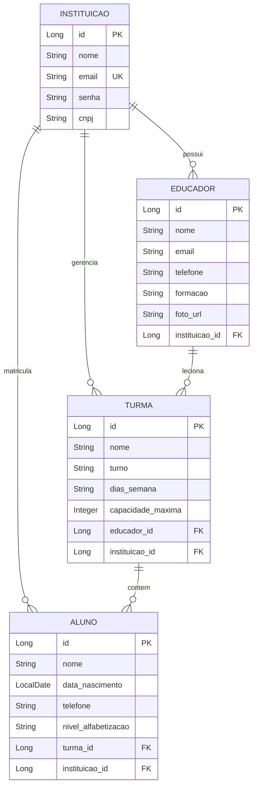

# Plano de Implantação — Autenticação, Multi-Tenancy e Novo Design

Este plano descreve as alterações necessárias para adicionar o cadastro e autenticação de Instituições via JWT, associar os dados existentes a cada instituição (Multi-Tenancy), reformular a listagem de Educadores em formato de Cards com fotos e atualizar a identidade visual do sistema com base nas cores do logotipo.

---

## 1. Modificações no Banco de Dados (MySQL)

Adicionaremos a tabela `instituicao` e chaves estrangeiras nas tabelas existentes para isolamento dos dados de cada inquilino (tenant).

### Novo Script SQL (`schema.sql`)
Atualizaremos o [schema.sql](file:///C:/Users/Gustavo/.gemini/antigravity-ide/scratch/brasil-letrado/schema.sql) para incluir a criação da tabela `instituicao` e as restrições de chaves estrangeiras.

---

## 2. Backend (Java 21 + Spring Boot 3.4)

### 2.1 Novas Dependências (`pom.xml`)
Adicionaremos as dependências do Spring Security e do JWT:
- `spring-boot-starter-security`
- `com.auth0:java-jwt` (Versão `4.4.0`) para geração e validação de tokens JWT.

### 2.2 Novas Entidades e Relacionamentos
- **`Instituicao`**: Entidade JPA com `id`, `nome`, `email` (único), `senha` (criptografada com BCrypt) e `cnpj`.
- **`Educador`, `Turma`, `Aluno`**: Adicionar relacionamento `@ManyToOne` com `Instituicao` e campo `fotoUrl` em `Educador`.

### 2.3 Segurança e Autenticação JWT
- **`SecurityConfig`**: Configuração das regras de acesso.
  - Libera endpoints públicos: `POST /api/auth/register`, `POST /api/auth/login`, `GET /swagger-ui/**`, `GET /v3/api-docs/**`.
  - Exige autenticação via Header `Authorization: Bearer <token>` para todos os demais endpoints.
  - Registra o filtro de autenticação customizado.
- **`JwtTokenFilter`**: Intercepta as requisições, valida o token e define a instituição autenticada no contexto do Spring Security.
- **`JwtService`**: Serviço responsável por gerar e validar tokens baseados na instituição.
- **`AuthController`**: Gerencia o registro (`/api/auth/register`) e o login (`/api/auth/login`) de Instituições.

### 2.4 Isolamento de Dados (Multi-Tenancy)
Para garantir que cada instituição visualize apenas seus dados:
- Ajustar os Repositórios para conter métodos como `findAllByInstituicaoId(Long instId)`.
- Nos Controllers, recuperar o ID da instituição logada a partir do contexto de segurança e usá-lo como filtro obrigatório em todas as consultas e persistências (ex: associar automaticamente novos alunos à instituição ativa).

### 2.5 Seed de Dados (`DataLoader.java`)
- O loader cadastrará uma instituição padrão (ex: `escola@brasil.org` / `123456`) e associará todos os dados de seed anteriores (Paulo Freire, etc.) a ela para que o sistema não inicie vazio após o login.

---

## 3. Frontend (React + PrimeReact)

### 3.1 Identidade Visual e Cores da Logo
Atualizaremos o tema visual no arquivo [index.css](file:///C:/Users/Gustavo/.gemini/antigravity-ide/scratch/brasil-letrado/frontend/src/index.css) utilizando a paleta de cores do logotipo:
- **Verde Principal (Logo Ring):** `#1E5631` (Botões de ação primários, destaque)
- **Azul Escuro (Logo Lentes):** `#1E3A5F` (Navbar, títulos, botões secundários)
- **Laranja/Ouro (Logo Livro):** `#F5A623` (Status tags de destaque, detalhes)
- **Fundo Limpo:** Branco e cinza muito claro (`#fafafa` / `#ffffff`) com tipografia Inter escura para legibilidade premium.

### 3.2 Login e Fluxo de Autenticação
- **Página de Login (`/login`) & Registro (`/registro`):** Novas telas para as instituições acessarem e criarem suas contas.
- **Armazenamento de Token:** Salvar o JWT e o nome da instituição logada no `localStorage`.
- **Axios Interceptor:** Adicionar automaticamente o header `Authorization: Bearer <token>` a todas as requisições.
- **Área Restrita:** Proteger rotas no frontend. Caso o usuário não esteja logado, redirecioná-lo para a tela de login.

### 3.3 Listagem de Professores em Cards Responsivos
Substituiremos a tabela tradicional de educadores por um grid flexível de **Cards**:
- Cada card exibirá a foto de perfil do educador (ou um avatar gerado a partir do nome se não houver foto cadastrada).
- Nome, especialização, e-mail e telefone expostos de forma limpa e moderna.
- Botões de ação (editar e excluir) posicionados discretamente no canto inferior de cada card.

---

## 4. Plano de Verificação

### Testes Automatizados (Backend)
- Ajustar os testes de controller existentes para enviar o token JWT gerado e certificar que todos os CRUDs continuam passando perfeitamente.

### Verificação Manual
1. Abrir a tela do sistema, que redirecionará para `/login`.
2. Fazer login com a instituição padrão (`escola@brasil.org` / `123456`).
3. Verificar se as telas `/educadores`, `/turmas` e `/alunos` carregam apenas os dados daquela instituição.
4. Testar a criação de um novo Educador e ver se o card responsivo é exibido com sua foto de perfil correspondente.
5. Cadastrar uma nova instituição em `/registro`, fazer login com ela e validar que as tabelas/cards aparecem totalmente vazios (garantindo o isolamento).
